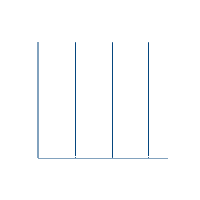

  

  

  

  
  
  

  <table width="850" border="0" cellpadding="20" cellspacing="0" style="background-color: #0D1117; border: 1px solid #00FF00; border-radius: 10px;">
    <tr>
      <td width="35%" align="center" valign="top">
        
          
        <code><b style="color:#00FF00;">[NETSTAT: ONLINE]</b></code> 
        
      </td>
      <td width="65%" style="border-left: 2px solid #00FF00; padding: 20px;">
          <h3 align="left"><code style="color: #00FF00;">LC@mainframe:~# cat profile.sys</code></h3>
          <h3 align="center" style="color: #E2E8F0;">🔥 Full-Stack Dev | 🛡️ CyberSec | ⚔️ Red Teamer</h3>
          
<i>"Defined by actions, not a name."</i>

          

          <ul style="line-height: 1.8;">
              <li><code style="color:#00FF00;">[+]</code> <b>Class:</b> Ghost in the Machine</li>
              <li><code style="color:#00FF00;">[+]</code> <b>Focus:</b> Secure Web Dev, System Architecture, OffSec</li>
              <li><code style="color:#00FF00;">[+]</code> <b>Core Directive:</b> <code>["Explore. Innovate. Exploit."]</code></li>
          </ul>
          

             
<b><code style="color: #00FF00; cursor: pointer;">> ./view_offline_routine.sh (Expand)</code></b>

             

                > Loading... 
                > 🎵 Music: Lo-Fi Synthwave 
                > 🎬 Movies: Hackers & Sci-Fi 
                > 💻 Hobbies: Exploitation logic analysis
             

          

      </td>
    </tr>
  </table>

 

  

  <table width="850" border="0" cellpadding="20" cellspacing="0" style="background-color: #0D1117; border: 1px solid #00FF00; border-radius: 10px;">
    <tr>
      <td width="30%" align="center" valign="middle">
         
      </td>
      <td width="70%" style="border-left: 1px dashed #00FF00;">
        <b><code style="color: #00FF00; font-size: 16px;">> cd /usr/bin/languages/</code></b>  
          
      </td>
    </tr>
    <tr>
      <td width="30%" align="center" valign="middle" style="border-top: 1px dashed #00FF00;">
        
      </td>
      <td width="70%" style="border-top: 1px dashed #00FF00; border-left: 1px dashed #00FF00;">
        <b><code style="color: #00FF00; font-size: 16px;">> cd /usr/bin/frontend_&_backend/</code></b>  
          
          
      </td>
    </tr>
    <tr>
      <td width="30%" align="center" valign="middle" style="border-top: 1px dashed #00FF00;">
         
        
      </td>
      <td width="70%" style="border-top: 1px dashed #00FF00; border-left: 1px dashed #00FF00;">
        <b><code style="color: #00FF00; font-size: 16px;">> cd /usr/bin/devops_os_ide/</code></b>  
          
          
          
      </td>
    </tr>
  </table>

 

<!-- ALGORITHMS -->

  

  <table width="850" border="0" cellpadding="20" cellspacing="0" style="background-color: #0D1117; border: 1px solid #00FF00; border-radius: 10px;">
    <tr>
      <td width="40%" align="center" valign="middle">
        
      </td>
      <td width="60%" style="border-left: 2px solid #00FF00;">
        <blockquote style="border-left: 4px solid #00FF00; padding-left: 10px;">
          <b style="color: #00FF00;">[SYSTEM ALERT]</b> 
          <i style="color: #94A3B8;">Bypassing computational limits & cracking algorithms.</i> 
          <i style="color: #94A3B8;">Scanning for active hacking modules... Modules found.</i>
        </blockquote>
         
        
         
        
        
      </td>
    </tr>
  </table>

 

  

  <table width="850" border="0" cellpadding="20" cellspacing="0" style="background-color: #0D1117; border: 1px solid #00FF00; border-radius: 10px;">
    <tr>
      <td width="50%" align="center" valign="middle">
        
      </td>
      <td width="50%" align="center" valign="middle" style="border-left: 1px dashed #00FF00;">
        
      </td>
    </tr>
    <tr>
      <td colspan="2" align="center" valign="middle" style="border-top: 1px dashed #00FF00;">
         
        
      </td>
    </tr>
  </table>

  <table width="850" border="0" cellpadding="20" cellspacing="0" style="background-color: #0D1117; border: 1px solid #00FF00; border-radius: 10px;">
    <tr>
      <td width="40%" align="center" valign="middle">
        
      </td>
      <td width="60%" align="left" style="border-left: 2px solid #00FF00;">
        <code style="color: #00FF00; font-size: 15px;"><b>[!] Incoming encrypted connection...</b></code>   
        
Establish a secure P2P connection to local nodes:

         
        

          
          
          
          
          
        

      </td>
    </tr>
  </table>

  

 

  
    
  
  
  
  
    
  <code style="color: #00FF00; font-size: 16px;">[CONNECTION TERMINATED - WAIT FOR NEXT INSTRUCTION]</code>

